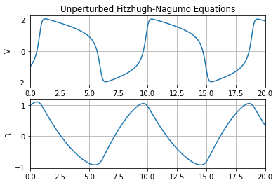
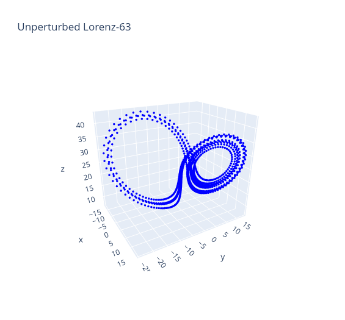
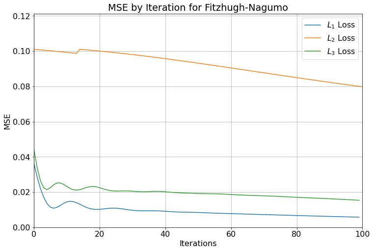
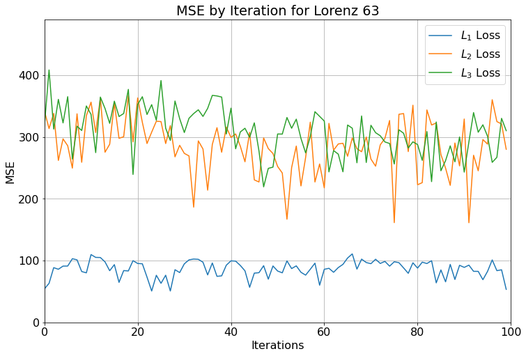

I wanted to post this here because I thought it was a bit sad that it never really saw the light of day after it more or less consumed me for several months. Dynamical systems has been something of a passion of mine for years, ever since I took a class on the topic during my Bachelor's Degree and read <a href="https://www.stevenstrogatz.com/books/nonlinear-dynamics-and-chaos-with-applications-to-physics-biology-chemistry-and-engineering">Steven Strogatz's book</a>. I wrote this in the Winter of 2022 while finishing up my Master's in Engineering Sciences and Applied Mathematics at Northwestern and submitted it as a supplement to my application to the Industrial Engineering and Management Sciences program, to which I was admitted but did not end up attending. This was written under the advisement of <a href="https://www.mccormick.northwestern.edu/research-faculty/directory/profiles/plumlee-matthew.html">Dr. Matthew Plumlee</a>, whose work you should be checking out instead of mine, honestly.  

I intend to write something that could serve as an introduction to this area of research at some point, mostly because I think it's neat. Nonlinear Dynamical Systems are one of those mathematical constructs that sound really scary but are shockingly easy to understand and apply. Plus this project included some usage of backpropagation outside of the context everyone seems to associate it with these days, that being Machine Learning.  

You can find this paper in its original form, all in TeX, on my <a href="https://github.com/ariakoehler/dynamical-systems-learning/blob/main/report/report.pdf">GitHub</a>.

# Introduction

## Direction

Dynamical systems models have been used to great effect in a variety of
different fields. Though analysis of these models is well-worn, some
issues remain when it comes to aligning the model to real-world data.

One is the issue of parameter estimation. Though frameworks exist for
estimating the parameters of a differential equation, the problem of
minimizing 2-norm between a model's predictions and a given dataset is,
in general, ill-posed[^chung]. Thus, the problem of finding a model that
minimizes the 2-norm still has challenges, even moreso for the problem
of finding a model that is interpretable.

The problem is to find $$f$$ such that the solution $$x(\eta)$$ of
$$\dot{x} = f(x,\eta)$$ approximates the solution $$x^*$$ of
$$\dot{x}^* = f^*(x)$$ optimally under a given loss $$L(x^*, x(\eta))$$
(further details on the loss later). There are a few main contributors
to the model's overall loss. The sources of focus going forward are
discretization error, model error, and "true" stochastic noise. In this
paper, the issue of model error will be addressed. Model error is
defined broadly to be the error in the predicted outcomes of a dynamical
system due to misspecifying or underspecifying the dynamics governing
the change in the state vector. For example, if one sets
$$\dot{x} = k x$$, but in reality $$\dot{x} = k x^2$$, there is little hope
to recover the "true" model by simply finding $$k$$.

That is, consider a vector-valued function $$x$$, which evolves according
to $$\dot{x}(t) = f(x, \eta^*) \equiv f_0(x) + m^*(x),$$ defined on a
discretized time grid $$t_1, \ldots, t_N$$ and a given dynamical systems
model $$f_0(x),$$ for which there is some *a priori* reason to believe is
a good model for the time-evolution of $$x$$. Then the problem is to find
$$f(x, \eta) = f_0(x) + m(x, \eta),$$ such that $$L(x^*, x(\eta))$$ is
minimized.

One advantage of this approach in the context of a general problem is
the ability to make use of both domain knowledge--through incorporation
of the initial model $$f_0$$--and data by way of learning
$$m^*(x)$$[^levine].

These are far-reaching issues, and we will not try to solve them all in
this article, but we think that approaching them as a unified problem
will provide useful ways of thinking as the field progresses.

# Background

## Parameter Estimation

The first problem to be considered is that of estimating parameters
$$\eta^*$$. That is, given $$f(x,\eta)$$ and a set of data
$$x^*_1, \ldots , x^*_N$$, can an estimate of $$\eta^*$$ be obtained?

One such approach to this problem involves Bayesian statistical models,
as in Gelman, et al. (1996). This approach begins with a prior
distribution describing model parameters. The differential equations are
then solved numerically under the given parameter values, and the prior
distributions are updated according to a Bayesian update procedure. This
approach has several advantages, in particular that it is able to
account for hierarchical effects. In the particular problem considered,
there are both population effects and individual effects, which can be
considered at the same time with their hierarchical structure
intact.[^gelman] However, this method also requires performing MCMC,
which does not always converge in easily predictable ways, and its
convergence can rarely be verified.[^vehtari] Primarily for this reason,
we will favor methods that do not involve performing MCMC.

More recently, more methods have arisen which rely on basis function
expansions. Ramsay, et al. (2007), use one such method which treats the
problem as a nested optimization. In an outer problem, updates are
performed on the model parameters, optimizing the Euclidean distance
between the model's predictions and observed data. The inner problem
finds the coefficients for the basis functions which solve the
differential equations for the current parameters.[^ramsay]

Even more recently, Levine and Stuart (2021) use techniques from machine
learning to predict unobserved states that may affect the observed state
vector. The methods are remarkably powerful and show additionally that
starting with an educated guess of the true model can cause RNN
predictions to reach optimality much faster than when they are given
only data.[^levine] However, there are several questions that the
authors do not answer. For example, it is not clear that these
parameters are uniquely interpretable. The method might have terms that
cancel each other, and the given model may be absorbed in the estimated
part.

## Uncertainty Quantification in Numerical Solutions of ODEs

While estimating the parameters of the ODEs themselves is a large part
of this problem, it may also be useful to know how precise those
estimates are. For example, Chkrebtii, et al. (2016) use a Bayesian
method that conditions on model uncertainty in order to solve the system
itself. They also use a quantification of model information to prove
convergence properties of their algorithm, which could be challenging to
show for other methods.[^chkrebtii] However, the use of Bayesian methods
can lead to a variety of practical problems which the proposed methods
will try to avoid, as noted above.

These problems are difficult to avoid, however, when quantifying
uncertainty. Most current methods of uncertainty analysis require the
use of Bayesian methods, largely because the posterior distribution of
an estimated parameter typically comes packaged with a measure of
variance. For example, Cockayne, et al. (2019) lays out a set of
reasonable conditions under which the solution to a Dynamical Systems
attained using Bayesian methods can give the average-case error of the
parameter estimates.[^cockayne]

# Current Project

While the above is meant to give context for this project, the scope of
this work is limited to reproducing some of the literature results and
providing a proof of concept for future work.

Consider the system describing the evolution of the vector-valued
function $$x: \mathbb{R} \times \mathbb{R}^{p \times d} \to \mathbb{R}^m$$
according to the system $$\frac{d}{d t}x(t) = f(x,\eta),$$ where the
right-hand side is further divided into the known part and the unknown
part, $$f(x) = f_0(x) + m(x, \eta)$$, where $$f_0$$ is assumed known, while
$$m^*$$ is fixed and small relative to $$f_0$$.

Let $$z(\eta) \in \mathbb{R}^{N \times m}$$ be the numerical solution to
the system $$\dot{x}(\eta) = f(x,\eta)$$ over a uniform time grid
$$t=t_1,\ldots, N$$, and let $$z^*$$ be defined similarly for
$$\dot{x}(\eta) = f(x,\eta)$$. Also let $$\{m_i(x)\}_{i=1}^p$$ be a set of
elementary function and define the $$j^{\text{th}}$$ entry of $$m(x)$$ to be
$$m^j(x, \eta) = \sum_{i=1}^d \eta_{ij} m_i(x)$$, a superposition of
known, elementary functions of $$x$$, scaled by the parameters in
question, $$\eta^*$$ (future work may consider cases when $$m$$ is more
complicated). The goal then, is to find $$\eta$$ such that
$$L(z^*, z(\eta))$$ is minimized.

# Methodology

Our approach to the problem of estimating $$\eta$$ will leverage recent
developments in the fields of machine learning and numerical
optimization, in particular the `autograd` functionality of `torch`,
which allows automatic computation of derivatives with respect to the
parameters.[^biggs] Those derivatives can then be used to perform
backpropagation in order to learn $$\eta^*$$ through iterated
approximations $$\eta$$.

## Backpropagation-Based Optimization

Our main approach to learning the small parameters $$\eta_{ij}$$ of our
model involves fairly straightforward backpropagation. We choose a
suitable norm $$\|\cdot\|$$ and a suitable way to make predictions, the
details of both of which are discussed further in
[5.2](#norms){reference-type="ref" reference="norms"}. Then we let
`torch` handle the details of computing the gradients with respect to
$$\eta$$ of each step in the computation of our predictions, which will
produce an update for each value of $$\eta$$. We can also check, for
processes that are reasonably approximated by linear functions, that the
updates to $$\eta$$ are reasonable by computing simple finite differences,
along the lines of
$$\delta\eta_{ij} = \frac{ \| x(\eta + \varepsilon p_{ij}) \| - \| x(\eta - \varepsilon p_{ij}) \| }{2 \varepsilon},$$
where $$p_ij$$ is chosen as the such that of its $$ij^{th}$$ element is $$1$$
and all others are $$0$$.

## Choice of Evaluation Criteria {#norms}

Any such backpropagation method relies upon a loss, which measures the
fidelity of the estimated model to the true model. We will look at three
choices.

One such loss function considers the full numerical solution to the ODE
with $$\eta$$ given and compares it to the full numerical solution of the
true model. Define
$$L_1(z^*, z(\eta)) = \frac{1}{N} \sum_{i=1}^N \|z_i^* - z(\eta)_i\|_2^2.$$
This loss is intuitive but might not provide useful information when the
proposed model's solution differs greatly from that of the true model.

One loss which might provide better information compares the differences
of $$x^*$$ to the per-time-step changes in the proposed model. Define
$$y^* \in \mathbb{R}^{N-1}$$ such that
$$y^*_i = z^*_{i+1} - z^*_i,\, i = 1, \ldots , N-1.$$ These are meant to
capture the step-by-step change in the true solution. Then let the new
loss
$$L_2(z^*, z(\eta)) = \frac{1}{N} \sum_{i=1}^N \| y^*_i - m(z_i^*, \eta) \|^2_2.$$
This has a few advantages over $$L_1$$, including that it remains useful
even if the predicted solution and the true solution behave very
differently, as it only considers the change in state over short periods
of time. It also does not require ever solving the proposed model, which
makes the algorithm converge much faster.

A third loss which we will consider resembles $$L_2$$ in that it depends
upon diffs but considers the full solution of the problem for $$\eta$$
given. Define $$y(\eta) \in \mathbb{R}^{N-1}$$ according to
$$y^*_i = z(\eta)_{i+1} - z(\eta)_i,\, i = 1, \ldots , N-1$$. Then denote
$$L_3(z^*, z(\eta)) = \frac{1}{N} \sum_{i=1}^N \|y^*_i - y(\eta)_i\|_2^2$$

# Sample Problems {#examples}

We will focus on two systems primarily: the Fitzhugh-Nagumo system,
which generally has stable behavior with respect to its parameters, and
Lorenz-63 which exhibits chaotic behavior, which may make the task of
learning $$\eta$$ much harder.

## Fitzhugh-Nagumo

The Fitzhugh-Nagumo equations are defined as follows:

$$\begin{aligned}
  \dot{V} &= c \left(V - \frac{V^3}{3} + R \right)\\
  \dot{R} &= -\frac{1}{c} \left( V - a - b R \right)\end{aligned}$$

The specific history of this system, as well as a description of its
behavior of it are given in [^ramsay]. Take $$a=0.2,\, b=0.2,\, c=3.0$$,
which produces oscillations in the state vector.

## Lorenz 63

The Lorenz-63 System is given as the following:

$$\begin{aligned}
  \dot{x} &= \sigma (y - x)\\
  \dot{y} &= x ( \rho - z ) - y\\
  \dot{z} &= x y - \beta z\end{aligned}$$

For choices of parameters $$\sigma=10,\, \rho=28,\, \beta=\frac{8}{3}$$,
this produces a chaotic attractor. Due to the chaotic behavior of the
Lorenz attractor, even small changes in the right-hand side of its
equations can cause significant change in the trajectory of the
solution.

# Results

The methods described in [5](#methodology){reference-type="ref"
reference="methodology"} are applied to perturbed versions of the two
systems in [6](#examples){reference-type="ref" reference="examples"}
using the norms $$L_1$$, $$L_2$$, and $$L_3$$. The methods are then evaluated
for convergence and runtime. As these methods are still a work in
progress, evaluations will be based primarily upon qualitative behavior,
rather than numerical evaluations of performance.

## Fitzhugh-Nagumo

The Fitzhugh-Nagumo system exhibits oscillations for the chosen
parameters and has stable behavior for small perturbations of its
parameters.[^ramsay] However, perturbing the system with terms outside
of the usual model is less well-understood. Thus, it will make a good
test of how well the learning algorithm behaves in regions of parameter
space where the function's behavior is not well known.

Taking $$f_0$$ to be the vector of right-hand side functions listed
earlier, a basis of $$[V^2, R^2]$$ was chosen for the added terms so as to
not overlap with terms already in the model. The "true" values were
generated by numerically solving the system where $$m^*(x)$$ is defined as
$$m(x,\eta^*)$$, and $$\eta = \big[\begin{smallmatrix}
  0.3 & 0\\
  0   & 0.05
  \end{smallmatrix}\big].$$ Choosing $$m^*$$ to be of the same form as $$m$$
has some advantages, including that it allows for confirmation when the
algorithm recovers the actual model used to generate the ground truth,
as opposed to simply an $$\eta$$ that works. The algorithm is then set to
train for $$100$$ iterations or until it converges.

$$100$$ iterations is not long enough for any of these methods to
converge, but it is enough to demonstrate that both $$L_1$$ and $$L_3$$
start decreasing the overall error and converging to the optimum
rapidly. The $$L_2$$ loss behaves strangely and, looking forward to its
long-term behavior, does not converge and eventually starts producing
nonsense. This is likely due to errors in programming that will be fixed
in the future. Nonetheless, the fact that the algorithm converges for
this case is evidence that it is a powerful algorithm worth pursuing in
future work.

## Lorenz 63

The Lorenz-63 system is chosen to test the learning method presented
primarily because of its chaotic dynamics. Though its chaotic attractor
exists for a variety of parameter values, individual trajectories
starting from the same initial point change drastically for slight
changes in parameter values, making the task of guessing the effects due
to small changes in parameters very difficult. Thus, if an algorithm
learns perturbing terms reliably for the Lorenz system, it can be
expected to do the same for most reasonable systems.

Taking $$f_0$$ to be the vector of the right-hand side functions listed
earlier, a basis of $$[y z, x^2]$$ was chosen for the added terms so as to
not overlap with terms already in the model. Similarly to before,
$$m^*(x)$$ is defined as $$m(x,\eta^*)$$, and
$$\eta = \big[\begin{smallmatrix}
  0 & 0.003\\
  0 & 0\\
  0.005 & 0
  \end{smallmatrix}\big].$$

The Lorenz system is in general much harder than other classical
dynamical systems to apply numerical methods to, and these results are
no exception. As mentioned previously, there is more work to be done in
fully implementing the methods described in this paper, and the lack of
convergence for any of these experiments is evidence that more
methodological work may need to be done as well.

## Conclusions

These results should be treated as preliminary and certainly not
reflective of the full potential of the methods described in this
report. There remains much tuning and reworking. For example, the $$L_2$$
loss appears to still have coding issues, as training with it with a
better-tuned optimizer often causes it to converge to solutions that are
neither optimal nor zero-gradient.

However, these results do show that the methods we have proposed have
promise. Under certain conditions and given enough time, the algorithm
often converges to the correct value of $$\eta$$. Moving forward with the
easy-to-compute $$L_2$$ and expanding the algorithm to include larger
bases could produce a very powerful algorithm for learning the
parameters of Dynamical Systems.

# Notation

-   $$d$$: Number of dimensions of state vector

-   $$N$$: Number of time points

-   $$p$$: Number of basis functions we search over when looking for
    unmodelled terms.

-   $$t_i$$: Time at point $$i$$

-   $$x_i^* \in \mathbb{R}^d,\, i=1,\ldots, N$$: State vector of the
    "true" model at time $$t_i$$.

-   $$x_i(\eta) \in \mathbb{R}^d,\, i=1,\ldots, N$$: State vector of the
    approximate model at time $$t_i$$.

-   $$f_0: \mathbb{R}^d \to \mathbb{R}^d$$: Basic model, which is known in
    principle.

-   $$m^*(x, \eta): \mathbb{R}^d \to \mathbb{R}^d$$: Unmodelled terms in a
    system, which we will call *supplemental terms*. In principle not
    known.

-   $$m_i(x)$$: Basis functions for approximating $$m^*$$. Write
    $$m(x) = \sum_{i=1}^{p} \eta_i m_i(x)$$.

-   $$f^*(x) = f_0(x) + m^*(x)$$: True full model, including supplemental
    terms.

-   $$f(x, \eta) = f_0(x) + m(x, \eta)$$: Predicted model, including known
    terms and estimated supplemental

-   $$\eta \in \mathbb{R}^{p \times d}$$: Parameters associated with the
    functions in our search basis.

# Additional Information

The code used to obtain the results seen here can be found at
<https://github.com/ariakoehler/dynamical-systems-learning>.

# Citations

[^chung]: Matthias Chung, Mickaël Binois, Robert B. Gramacy, Johnathan M. Bardsley, David J. Moquin, Amanda P. Smith, and Amber M. Smith. Parameter and uncertainty esitmation for dynamical systems using surrogate staochastic processes. SIAM Journal of Scientific Computing, 41(4):A2212 – A2238, 2019.

[^levine]: Matthew E. Levine and Andrew M. Stuart. A framework for machine learning of model error in dynamical systems, 2021.

[^gelman]: Andrew Gelman, Frederic Bois, and Jiming Jiang. Physiological pharmacokinetic analysis using population modeling and informative prior distributions. Journal of the American Statistical Association, 91(436):1400–1412, 1996.

[^vehtari]: Aki Vehtari, Andrew Gelman, Daniel Simpson, Bob Carpenter, and Paul-Christian Brkner. Rank-Normalization, Folding, and Localization: An Improved R for Assessing Convergence of MCMC (with Discussion). Bayesian Analysis, 16(2):667 – 718, 2021.

[^ramsay]: J. O. Ramsay, G. Hooker, D. Campbell, and J. Cao. Parameter estimation for differential equations: a generalized smoothing approach. Journal of the Royal Statistical Society: Series B (Statistical Methodology), 69(5):741–796, 2007.

[^chkrebtii]: Oksana A. Chkrebtii, David A. Campbell, Ben Calderhead, and Mark A. Girolami. Bayesian Solution Uncertainty Quantification for Differential Equations. Bayesian Analysis, 11(4):1239 – 1267, 2016.

[^cockayne]: Jon Cockayne, Chris J. Oates, T. J. Sullivan, and Mark Girolami. Bayesian probabilistic numerical methods. SIAM Review, 61(4):756–789, 2019.

[^biggs]: Michael Bartholomew-Biggs, Steven Brown, Bruce Christianson, and Laurence Dixon. Automatic differentiation of algorithms. Journal of Computational and Applied Mathematics, 124(1):171–190, 2000. Numerical Analysis 2000. Vol. IV: Optimization and Nonlinear Equations.
